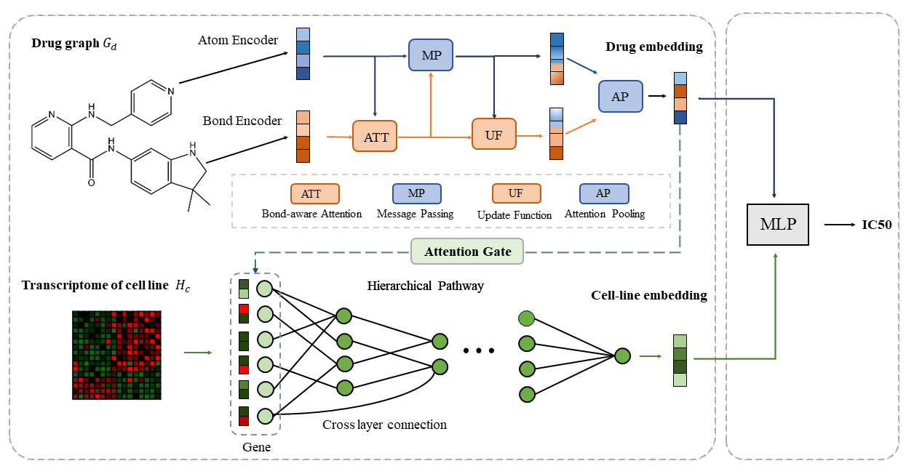

# Interpretable Drug Response Prediction through Molecule Structure-aware and Knowledge-Guided Visible Neural Network

## Summary

DrugVNN is an end-to-end drug response prediction framework, which extracts gene features of cell lines through a knowledge-guided visible neural network (VNN), and learns drug representation through a node-edge communica-tive message passing network (CMPNN). Between these two networks, a novel drug-aware gene attention gate is designed to direct the drug representation to VNN to simulate the effects of drugs.

 

## Install

We provide linux commands to install the environment. You will need the conda package manager, which can be installed from [here](https://www.anaconda.com/products/individual).

To install the required packages, follow there instructions (tested on a linux terminal):

- clone the repository

    `git clone https://github.com/biomed-AI/DrugVNN`

- cd into the cloned directory

    `cd DrugVNN`

- install the environment using anaconda3

    `conda env create -f environment.yaml`

## Run Experiments

Simply run:
`python main.py --mode test --model_path ./results/DrugVNN.pth --only_combine_child_gene_group` 

